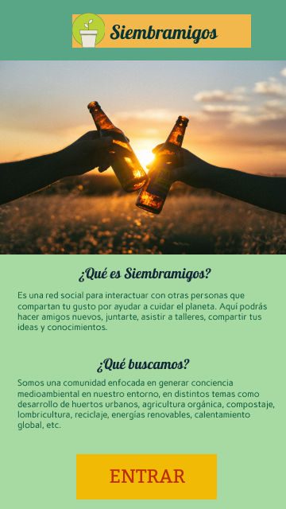
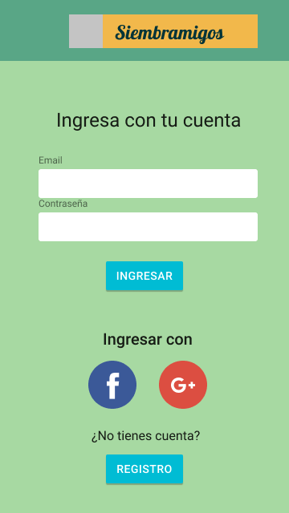
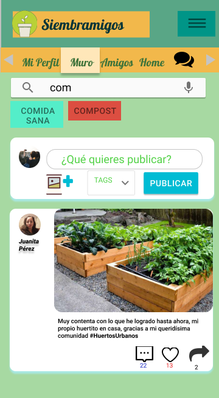

# Red Social

## Definición del producto

Nuestra aplicación es una red social enfocada en el cuidado del medio ambiente, y se basa en la necesidad como comunidad de generar conciencia medioambiental en nuestro entorno, tomando como público objetivo a personas comunes y corrientes, mayores de de edad, residentes en la zona urbana de la ciudad y que en su mayoría tiene dificultades para gestionar sus residuos de manera eficiente. Estas personas tienen un especial interés en el medio ambiente y puede que estén recién iniciando en este tema, como también puede que tengan profesiones afines y que quieran aportar hacia la sociedad con su conocimiento en distintos temas como desarrollo de huertos urbanos, agricultura orgánica, compostaje, lombricultura, reciclaje, energías renovables, calentamiento global, etc.
Basado en lo anterior, la aplicación tendrá una sección con diferentes tópicos donde cada persona podrá interactuar con respecto a los temas que le interesen, además de generar redes donde puedan juntarse, hacer talleres y generar conciencia en las demás personas, y así generar un impacto positivo sobre el entorno en el que viven.

## UX Design

### Prototipo de baja fidelidad

Landing page

Sección Log In

Sección registro

Ingreso al muro del usuario

### Prototipo de alta fidelidad

Landing Page

Sección Log In

Sección de registro

Ingreso al muro del usuario

Barra lateral desplegable

Sección amigos del usuario

Sección chat

